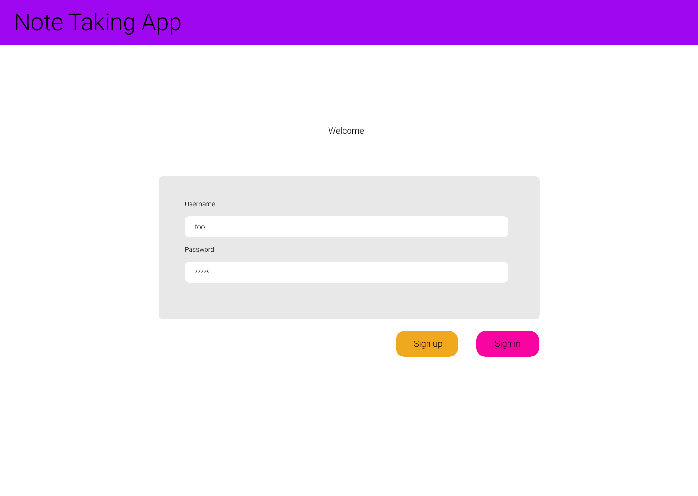
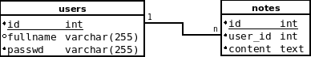

# Simple Note-Taking App (Not a real project)

Hi! I'll suppose you're my classmate and comes from our English class. :)

If you want to try this project, make sure you have [Node.js](https://nodejs.org/en/) 
v14 or greater. You can download it [here](https://nodejs.org/en/).

Clone this repo and into its directory, execute the following:

```
npm ci
npm run dev
```

`npm ci` will install the JS dependencies and `npm run dev` will start the application.
Once done, go to [http://localhost:3000](http://localhost:3000) and try this project out.

Feel free to make the changes you want. :)

## TODOs
* Support for multiline notes. 

## Known Bugs
Since multiline notes are not supported yet, when you try to add a note like this
```
Hi!
I'm
a multiline
note. :)
```
the backend doesn't know how to manage this case, and write the string into the
`notes.csv` as is. This produces a file corruption and break the program when try to
read from this database. Pleas don't write multiline notes, unless you have fixed this problem.

## Diagrams

### Client App

Interface Design

Login



All notes


Write note


Class Diagram


### Backend

System Diagram


Relational Diagram



Endpoints


